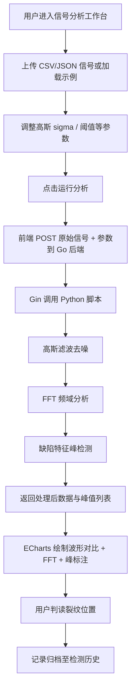

# 超声波金属零件缺陷检测分析工具 — 产品需求文档 (PRD)

## 1. 产品概述

一款面向无损检测 (NDT) 工程师与质量检验人员的超声波回波信号全栈分析工具。用户上传超声波探头采集的原始回波信号，系统通过高斯滤波与傅里叶变换去除噪声、提取缺陷特征峰，并在网页上以示波器风格直观对比过滤前后波形，帮助用户一眼定位金属零件内部裂纹位置与深度。
- 核心价值：把原本依赖专用仪器软件的信号处理流程搬上 Web，降低分析门槛，提升检测可视化与可追溯性。

## 2. 核心功能

### 2.1 用户角色
本工具为单用户离线分析工具，无需角色区分与注册登录。

### 2.2 功能模块
1. **信号分析工作台**（核心页）：信号上传、处理参数配置、原始/过滤波形对比、FFT 频谱、缺陷峰标注与统计
2. **检测历史**：历史分析记录列表、单条记录详情回看、记录删除

### 2.3 页面详情

| 页面名称 | 模块名称 | 功能描述 |
|-----------|-------------|---------------------|
| 信号分析工作台 | 信号上传区 | 拖拽/选择上传 CSV 或 JSON 原始回波信号，显示文件名、采样点数、采样率；支持加载示例数据 |
| 信号分析工作台 | 处理参数面板 | 高斯滤波 sigma、FFT 窗、缺陷峰显著度阈值、采样率等可调参数；一键运行分析 |
| 信号分析工作台 | 波形对比图 | 双轴叠加显示原始波形与滤波后波形，缺陷峰以红色脉冲标记定位裂纹位置 |
| 信号分析工作台 | FFT 频谱图 | 频率-幅值谱，标注主频与缺陷特征频带 |
| 信号分析工作台 | 缺陷峰列表 | 表格列出峰序号、时间位置、对应深度、幅值、显著度，点击高亮对应波形位置 |
| 信号分析工作台 | 统计概览卡片 | 采样点数、信噪比提升、检出缺陷数、最大峰幅值 |
| 检测历史 | 历史记录表格 | 时间、文件名、缺陷数、状态；支持查看详情与删除 |

## 3. 核心流程

用户进入工作台 → 上传/加载示例回波信号 → 调整滤波与检测参数 → 点击「运行分析」→ 前端将原始信号与参数 POST 至后端 → Go (Gin) 接收并调用 Python 脚本完成高斯滤波、FFT、峰值检测 → 返回处理后数据 → 前端用 ECharts 绘制过滤前后对比波形、FFT 频谱并标注缺陷峰 → 用户判读裂纹位置 → 记录自动归档至历史。

## 4. 用户界面设计

### 4.1 设计风格
- **整体风格**：工业示波器 / NDT 仪器控制台风格，深色技术感界面
- **主色**：深炭黑/深海军蓝背景 (#0a0e14 / #0d1117)；次级面板深灰 (#161b22)
- **强调色**：磷光绿 (#39ff14 / #00e676) 用于滤波波形，青色 (#00e5ff) 用于原始波形，红色脉冲 (#ff3d3d) 标注缺陷峰
- **按钮风格**：工业风方角/微圆角，主操作按钮磷光绿带辉光，次级按钮深灰描边
- **字体**：显示字体用等宽科技感字体 (JetBrains Mono / Space Mono 之一) 用于数据与标题；正文用清晰无衬线
- **布局风格**：顶部窄导航 + 左侧参数控制栏 + 右侧主图表区网格布局，示波器栅格背景
- **图标/符号**：线性工程图标，波形/脉冲/扫描类符号
- **动效**：扫描线加载动画、波形绘制动画、峰标记脉冲闪烁、数据卡片数值滚动

### 4.2 页面设计概览

| 页面名称 | 模块名称 | UI 元素 |
|-----------|-------------|-------------|
| 信号分析工作台 | 顶部导航栏 | 工具标题、扫描线动画 Logo、历史记录入口 |
| 信号分析工作台 | 信号上传区 | 拖拽虚线框、文件信息卡、加载示例按钮 |
| 信号分析工作台 | 参数面板 | 滑块/数值输入、运行分析主按钮(辉光)、示波器栅格背景 |
| 信号分析工作台 | 波形对比图 | ECharts 双线叠加、栅格背景、峰标记、坐标轴刻度 |
| 信号分析工作台 | FFT 频谱图 | ECharts 频谱柱/线图、主频标注 |
| 信号分析工作台 | 缺陷峰列表 | 深色表格、红点状态、点击行高亮波形 |
| 信号分析工作台 | 统计概览卡片 | 等宽数字、辉光数值、趋势小图 |
| 检测历史 | 历史记录表格 | 时间倒序、状态徽章、操作按钮 |

### 4.3 响应式
- 桌面优先 (≥1280px) 设计，主工作台采用左右栅格布局
- 平板 (768-1280px) 参数栏折叠为顶部抽屉
- 移动端仅保留上传与单图查看，触控优化按钮尺寸

### 4.4 3D 场景
本项目不涉及 3D 场景。
