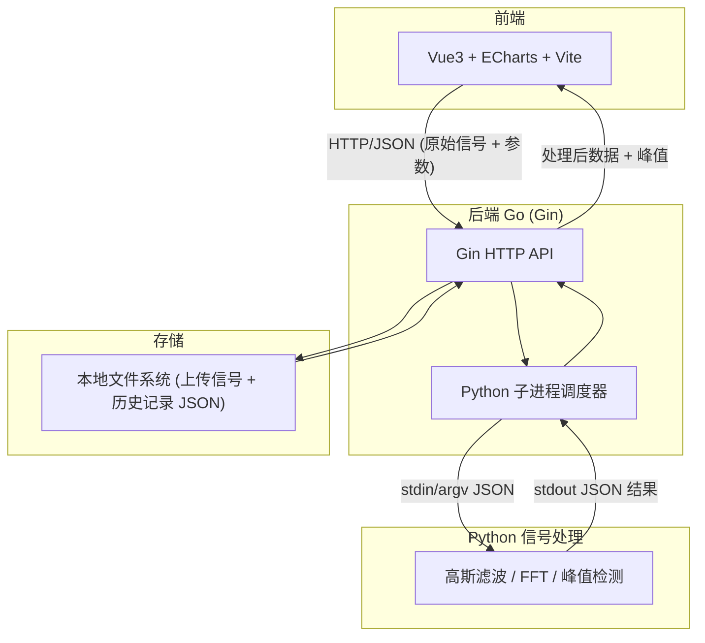
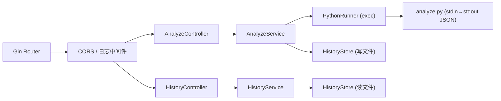
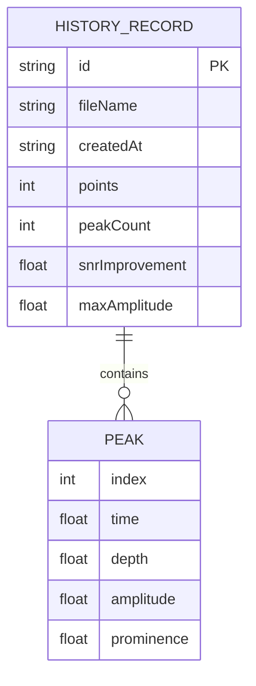

# 超声波金属零件缺陷检测分析工具 — 技术架构文档

## 1. 架构设计



## 2. 技术说明
- **前端**：Vue@3 + ECharts@5 (vue-echarts) + Vite + TailwindCSS
- **初始化工具**：`npm create vite@latest` (vue-ts 模板)
- **后端**：Go + Gin@1 + 跨域中间件 + exec 子进程调用 Python
- **数据处理**：Python3 + numpy + scipy (gaussian_filter1d / rfft / find_peaks)
- **数据存储**：本地文件系统（`./data/uploads` 存原始信号，`./data/history` 存历史记录 JSON），不引入数据库

## 3. 路由定义

| 路由 | 用途 |
|-------|---------|
| `/` | 信号分析工作台（核心页） |
| `/history` | 检测历史列表 |

## 4. API 定义 (Go/Gin)

### 4.1 运行分析
- `POST /api/analyze`
- 请求体 (JSON)：
```json
{
  "signal": [0.01, -0.02, 0.5, 0.9, "...原始幅值数组"],
  "sampleRate": 100.0,
  "params": {
    "gaussianSigma": 3,
    "fftWindow": "hann",
    "peakProminence": 0.2,
    "peakDistance": 10
  }
}
```
- 响应体 (JSON)：
```json
{
  "id": "20260621-103045",
  "raw": [/* 原始信号 */],
  "filtered": [/* 高斯滤波后信号 */],
  "fftFreq": [/* 频率轴 */],
  "fftMag": [/* 幅值谱 */],
  "peaks": [
    { "index": 120, "time": 1.2, "depth": 3.6, "amplitude": 0.85, "prominence": 0.4 }
  ],
  "stats": {
    "points": 2048,
    "snrImprovement": 12.4,
    "peakCount": 3,
    "maxAmplitude": 0.85
  }
}
```

### 4.2 历史记录
- `GET /api/history` → `{ "records": [ { "id", "fileName", "createdAt", "peakCount", "status" } ] }`
- `GET /api/history/:id` → 单条完整分析结果（同 4.1 响应结构 + fileName）
- `DELETE /api/history/:id` → `{ "ok": true }`

### 4.3 示例数据
- `GET /api/sample` → 返回一段内置合成超声波回波示例信号（含模拟缺陷峰 + 噪声）

## 5. 服务端架构图



## 6. 数据模型

### 6.1 数据模型定义
历史记录为 JSON 文件，无关系型数据库，故以结构体描述：



### 6.2 数据定义
无 SQL DDL。历史记录以文件 `./data/history/<id>.json` 持久化，结构即 4.1 响应体；原始上传信号存于 `./data/uploads/<id>.csv`。

## 7. 目录结构

```
cy5/
├── backend/                  # Go (Gin) 后端
│   ├── main.go
│   ├── go.mod
│   ├── handlers/             # 控制器
│   ├── services/             # 业务逻辑
│   └── data/                 # 运行时数据 (uploads/history)
├── python/                   # 信号处理脚本
│   ├── analyze.py            # 主处理入口
│   └── requirements.txt
└── frontend/                 # Vue3 + ECharts
    ├── src/
    ├── package.json
    └── vite.config.ts
```
